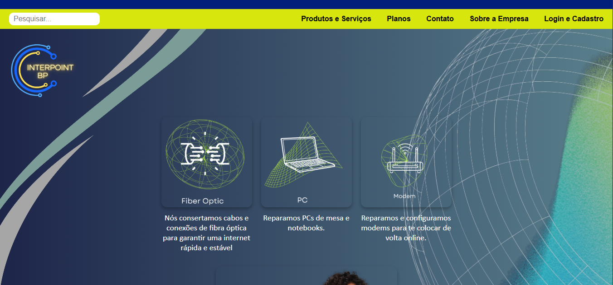

# InterPoint BP

Website desenvolvido como projeto acadêmico para simular o site institucional de uma empresa fictícia de internet chamada **InterPoint BP**.

O projeto apresenta páginas informativas sobre a empresa, planos de internet, produtos e serviços, além de uma interface de **login e cadastro de usuários**.
---

# 📸 Preview do projeto


##  Tecnologias utilizadas

* **HTML5** → Estrutura das páginas
* **CSS3** → Estilização e layout
* **Flexbox** → Organização de elementos na página

---

# 📂 Estrutura do projeto

```
interpoint-bp
│
├── index.html
│
├── pages
│   ├── produtos.html
│   ├── planos.html
│   ├── contato.html
│   ├── sobre.html
│   └── login.html
│
├── css
│   ├── index.css
│   └── login.css
│
├── img
│   ├── logo.png
│   └── fundo.png
│
└── README.md
```

---

## Funcionalidades

* Página inicial com apresentação da empresa
* Navegação entre páginas do site
* Página de planos de internet
* Página de produtos e serviços
* Página institucional sobre a empresa
* Página de contato
* Interface visual de login e cadastro
* Layout organizado utilizando boas práticas de desenvolvimento web

---

## Boas práticas aplicadas

* Separação de **HTML e CSS**
* Organização de arquivos em **pastas**
* Uso de **caminhos relativos**
* Estrutura de projeto semelhante a projetos profissionais

---

## Integrantes do projeto

* Gabriel Costa Lima
* Aryana de Morais
* Nicolas Claudiano

---

## Contexto acadêmico

Projeto desenvolvido para a disciplina de **Desenvolvimento Web / Interfaces** no curso de **Desenvolvimento de Software Multiplataforma (DSM)** da **FATEC**.

---

## Como executar o projeto

1. Baixe ou clone o repositório

```
git clone https://github.com/seuusuario/interpoint-bp.git
```

2. Abra a pasta do projeto

3. Execute o arquivo:

```
index.html
```

em qualquer navegador.

---

## Possível melhoria futura

* Implementação de **JavaScript**
* Sistema de **login funcional**
* Integração com **backend**
* Banco de dados para usuários

---

## Licença

Este projeto foi desenvolvido apenas para fins **educacionais**.

